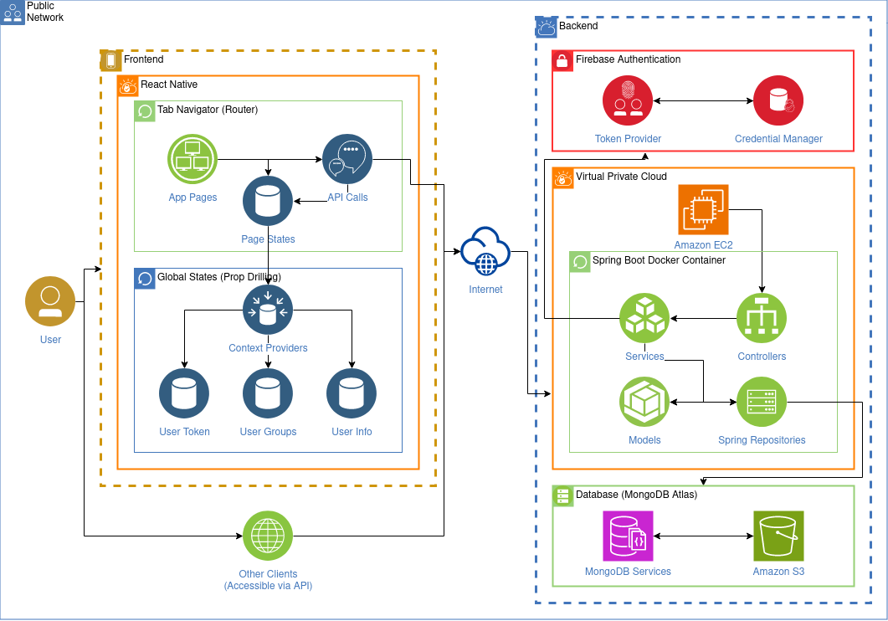

# Canyon

Canyon seeks to use limited questions to help facilitate meaningful interactions between users and increase engagement with each other, not just with the Canyon app itself.

[](https://www.youtube.com/watch?v=wN6ddzEGkuk)

## Table of Contents

1. [Architecture Diagram](#architecture-diagram)
2. [Documentation](#documentation)

- [Overview](#overview)
- [Frontend Technical](#frontend-technical)
- [Backend Technical](#backend-technical)
- [Endpoints](#endpoints)

3. [Miscellaneous](#miscellaneous)

## Architecture Diagram



## Documentation

### Overview

Our frontend is a simple React Native app with five main screens: a login/signup screen, a home screen displaying a user's groups, an answer screen to answer questions, a responses screen to view previous responses, and a profile screen to edit personal information.

The home page allows users to also scroll through individual groups, create new questions, view group members, and view previous question responses, and the answers page allows users to answer new questions and edit still-open questions.

Our backend is a simple RESTful API serving various requests necessary to run the Canyon app. Specific requests that can be made are listed in the endpoints section in the backend README, but they mainly comprise of authentication endpoints allowing users to sign up or log in, and view endpoints, which provide access (create, read, update, destroy) to a user's groups, questions, answers.

~~No installation needs to be done, as this is deployed online and accessible at [joincanyon.org](http://joincanyon.org). If you would like to run the backend yourself, please refer to the backend README's testing section to learn how to run the project locally.~~

Now that our EC2 instance is down, and we've stopped paying for a domain name, you will need to set things up yourself! Follow the docs in the `backend/` and `frontend/` folders for specific instructions regarding those parts of the project.

### Frontend Technical

Our project is split into the following structure:

- `src/`
  - `components/`
    - Provides shared components used across screens.
  - `screens/`
    - Provides the various screens of our app, served from `App.js`. Equivalent to React JS' `pages/` directory.
  - `store/`
    - Stores the context and state definitions for our global states.
  - `styles/`
    - Stores shared styles in addition to base styles for each screen to increase modularity
- Base App.js file is located outside the `src/` directory and contains the "entry point" of the frontend.

Some notable components and technologies are as follows:

**Groups.js**

- Component that holds all the group information of a specified group. Utilizes Interval for the timer functionality, calculated from UTC time as our EC2 instance is in UTC time. By using JavaScript `map()` functions paired with ternary operators on states `state ? <View /> : null`, our code remains very linear despite a non-linear interface with pop-up modals.

_OnClick_

- Data is fetched
- Abilitly to:
  - Create a new issue with our selectQuestion.js component
  - View previous responses with our Question.js component

**ResponsesPage.js and AnswerPage.js**

- Using our Question.js component as well

**Share Component**

- Share component from react-native allows us to send messages in native IOS and Android environments


**Contexts**

The most unintuitive thing about our application is our state management system. As the project is small, Redux was overkill. Instead, the frontend uses prop-drilling to pass a global state through the various screens and components.

On login, the home page does an initial fetch using the user's token of all the groups the user is in and stores it in a state called groups. This state is accessed in almost all other screens. When viewing a specific response or issue or some other attribute of a group, instead of calling an endpoint on our backend, the app instead utilizes helper methods within `store/info.js` to search for relevant information.

Likewise, updates/new information posted to the backend are received in a successful response message and directly replaced/added to the groups object, before updating the state to trigger a rerender across pages and components. Because of the smart usage of states, our app makes minimal calls to our rate-limited EC2 instance to reduce network costs and minimize application latency by eliminating the majority of redundant network calls.

What this implies to you, as a contributor, is that you need to utilize the groups, auth, and self context using `useContext()` and the specified context `InfoContext`, `AuthContext`, and `SelfContext` respectively in order to integrate seemlessly into existing pages. Either way, make sure to update the groups state in order to trigger rerenders for new information.

### Backend Technical

Our backend is split intuitively into the following structure:

- `java/.../canyon/`
  - `config/`
    - Provides configurations for object serialization, web security requirements, MongoDB, and access to environment variables specified in `resources/`
  - `controllers/`
    - Provides the routing and definitions of various endpoints to view the resources
  - `dto/`
    - Contains pre-written data transfer objects that help speed up the JSON to POJO (plain old Java object) serialization and a fast-fail mechanism in case of bad requests.
  - `models/`
    - Provides the structure of our models, used as our "schema" for our database and also within operations in the service layer.
  - `repositories/`
    - Provides prewritten queries to our MongoDB database alongside access to specific collections within the repository
  - `services/`
    - Provides the business logic for all our data
    - Basically all methods access Firebase Authentication to verify user identities for virtually all resources
- `resources/`
  - `static`
    - Provides our static webpages served at the base URL to GET HTTP requests
  - Contains configuration files such as `secrets.properties` that store user secrets and API keys

All files are properly organized to where there is no overlap, and each directory strictly holds files specific to that task.

Our models are as follows:

- Group:

  - `id: ObjectID // BSON ObjectID for MongoDB`
  - `name: String // name of group`
  - `issueCount: int // number of issues`
  - `issueFrequency: int // frequency of issues in seconds, manually changed`
  - `owner: User // reference to the owner of the group`
  - `members: List<User> // list of members in the group, including the owner`
  - `issues: List<Issue> // list of issues stored in time order`

  - Constructor:

    - `Group()`: Initializes a new instance of the Group class with default values.
    - `Group(String name, User owner)`: Initializes a new instance of the Group class with the specified name and owner.

  - Methods:
    - `setName(String name)`: Sets the name of the group.
    - `setOwner(User user)`: Sets the owner of the group. The user must be a member of the group.
    - `addMember(User user)`: Adds a user to the group if they are not already a member.
    - `removeMember(User user)`: Removes a user from the group if they are not the owner.
    - `getMembers()`: Returns the list of members in the group.
    - `newIssue(String question)`: Creates a new issue with the specified question if there are no existing issues or if the current issue is older than the issue frequency.
    - `currentIssue()`: Returns the current issue of the group, which is the last issue in the list.

- Issue:

  - `id: ObjectID // BSON ObjectID for MongoDB`
  - `issueNumber: int // issue number within the group`
  - `time: LocalDateTime // timestamp of when the issue was created`
  - `question: String // the question or topic of the issue`
  - `group: ObjectID // reference to the group the issue belongs to`
  - `responses: List<Response> // list of responses to the issue`

  - Constructor:

    - `Issue()`: Initializes a new instance of the Issue class with default values.
    - `Issue(Group group, String question)`: Initializes a new instance of the Issue class with the specified group and question.

  - Methods:
    - `addResponse(Response response)`: Adds a response to the issue and returns the added response if successful, or null otherwise.
    - `editResponse(Response response)`: Edits an existing response in the issue and returns the edited response if successful, or null otherwise.
    - `removeResponse(Response response)`: Removes a response from the issue and returns the removed response if successful, or null otherwise.

- Response:

  - `id: ObjectID // BSON ObjectID for MongoDB`
  - `response: String // the content of the response`
  - `user: User // reference to the user who created the response`
  - `group: ObjectID // reference to the group the response belongs to`
  - `issue: ObjectID // reference to the issue the response is associated with`

  - Constructor:
    - `Response()`: Initializes a new instance of the Response class with a default ID.
    - `Response(String response, User user, Group group)`: Initializes a new instance of the Response class with the specified response content, user, and group. It also sets the issue reference to the current issue of the group.

- User:

  - `id: ObjectID // BSON ObjectID for MongoDB`
  - `fId: String // Firebase ID of the user`
  - `name: String // name of the user`
  - `email: String // email of the user`
  - `groups: List<ObjectID> // list of ObjectIDs representing the groups the user belongs to`

  - Constructor:

    - `User()`: Initializes a new instance of the User class with an empty list of groups.
    - `User(ObjectId id, String fId, String name, String email)`: Initializes a new instance of the User class with the specified ID, Firebase ID, name, email, and an empty list of groups.

  - Methods:
    - `joinGroup(Group group)`: Adds the user to the specified group and returns the joined group if successful, or null otherwise.
    - `inGroup(ObjectId group)`: Checks if the user is a member of the specified group and returns true if they are, or false otherwise.
    - `leaveGroup(Group group)`: Removes the user from the specified group and returns true if successful, or false otherwise.

In summary, our chain of references are as follows (ie, fetching a singular group returns the following):

- Group Info (id, name, etc)
- Owner (actual user info, DBRefs)
- Members (DBRefs)
  - List of actual user info
- Issues
  - Issue info (id, time, etc)
  - List of actual responses (DBRefs)
  - Each response contains:
    - Response info (id, response, etc)
    - Actual user info (DBRef)
    - Soft references to issue and group (Object IDs)

Thus, using this design, all the information needed from a group can actually be fetched once, and with smart manipulation on the user agent's end, minimal operations after the initial fetch can be performed.

Note that each model uses Lombok, which provides default getter/setter methods that are overriden as necessary. With an understanding of the basic schema, developing new endpoints and services becomes trivial.

Existing controllers already encompass all models, so no new controllers should be made unless a completely new feature paired with a new model needs to be made. Authorization is delegated to `AuthController.java`, viewing groups is delegated to `GroupController.java`, issues to `IssueController.java`, and so on and so forth.

If new services need to be created, the services are split in the same way as the controllers. If authentication of the user is required at that specific service, include the following line before the body of the method in order to fetch the user object from the list of users in our DataBase:

```java
User user = firebaseService.fetchUser(token);
```

If new queries or aggregations need to be written, do so in the respective repositories in the `repositories/` directory. Note that Spring Boot's MongoDB integration provides many inferences, so a simple method name definition without the `@Query` annotation will suffice for the majority of use cases.

Some final notes:

- ObjectIDs do not properly serialize into string form by Jackson, so the following annotation needs to be included in new models: `@JsonSerialize(using = ObjectIdSerializer.class)`. Refer to `config/` and Jackson JsonSerializers for more information regarding the serializers.
- New endpoints will always require authentication unless ignored in `WebSecurityConfig.java`, including static content served on the main webpage.
- If you would like to replace the current static content in `resources/` using some framework such as React or Svelte, you will have to run their respective build commands and place the built files (often found in `build/`) into the `resources/static/` directory.

### Final Remarks

This is all you need to begin contributing to this project; read up on React if you aren't familiar with states and hooks, minimize the amount of backend calls to fetch redundant information, read up on Spring Boot/MongoDB documentation, remember that editted Java objects need to be re-saved into the repository, and you will be set to make quality contributions. Happy coding!

## Miscellaneous

Made with ❤️ by the Emory Canyoneers, ©️ Emory Canyoneers 2024 under the ⚖️ GNU GPL-3.0 license
